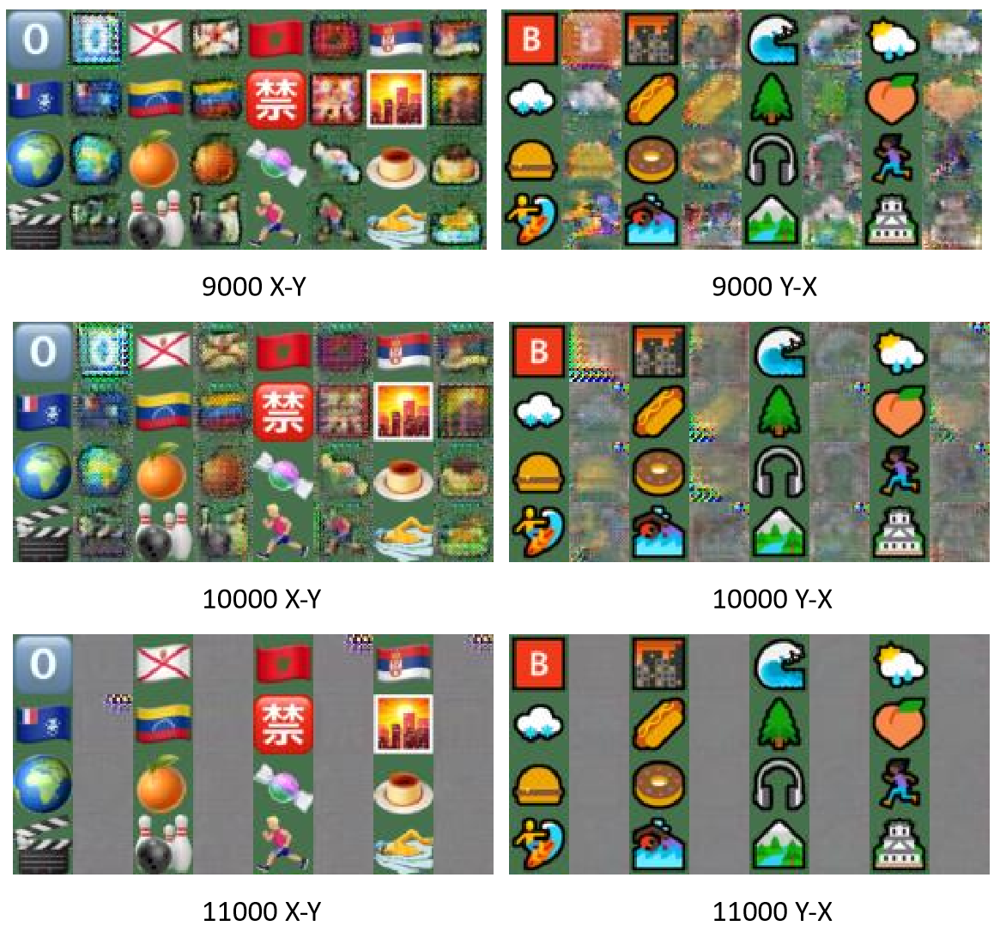
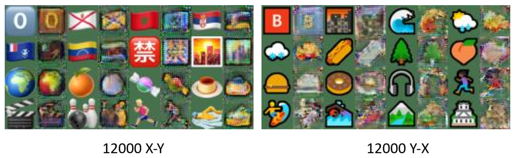
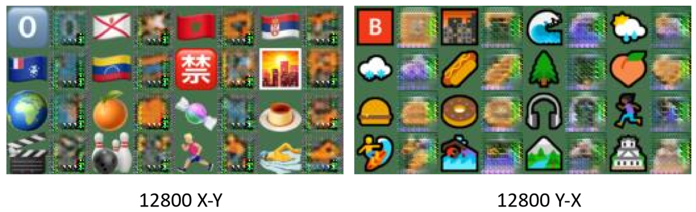
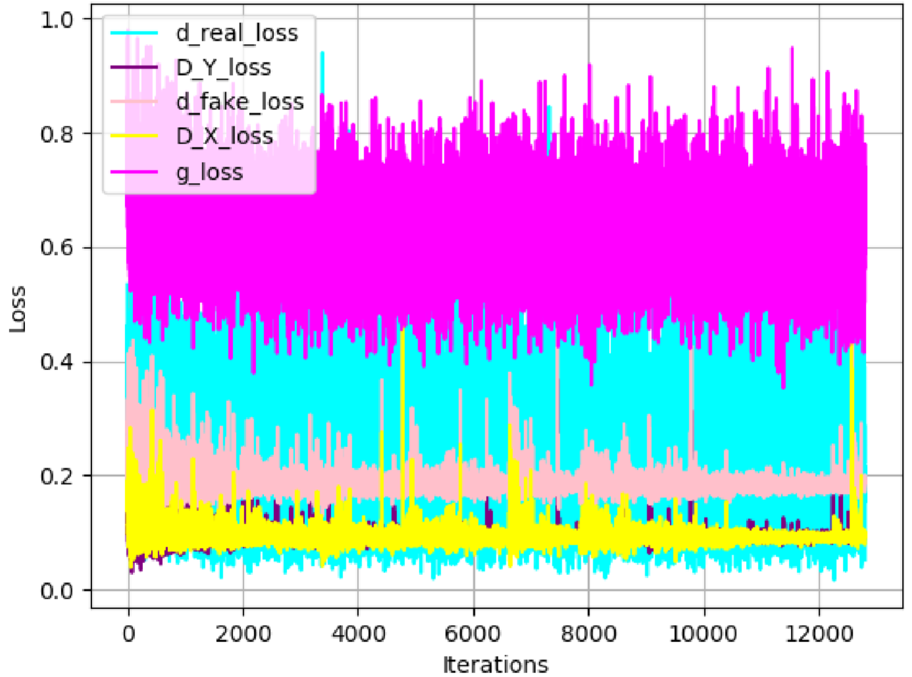

# Emoji style transer based on CycleGAN with PyTorch
## Overview
We implement cycleGAN with PyTorch to do emoji style transfer.

## Experiment Result
                                                      Images generated

                                                            Loss

